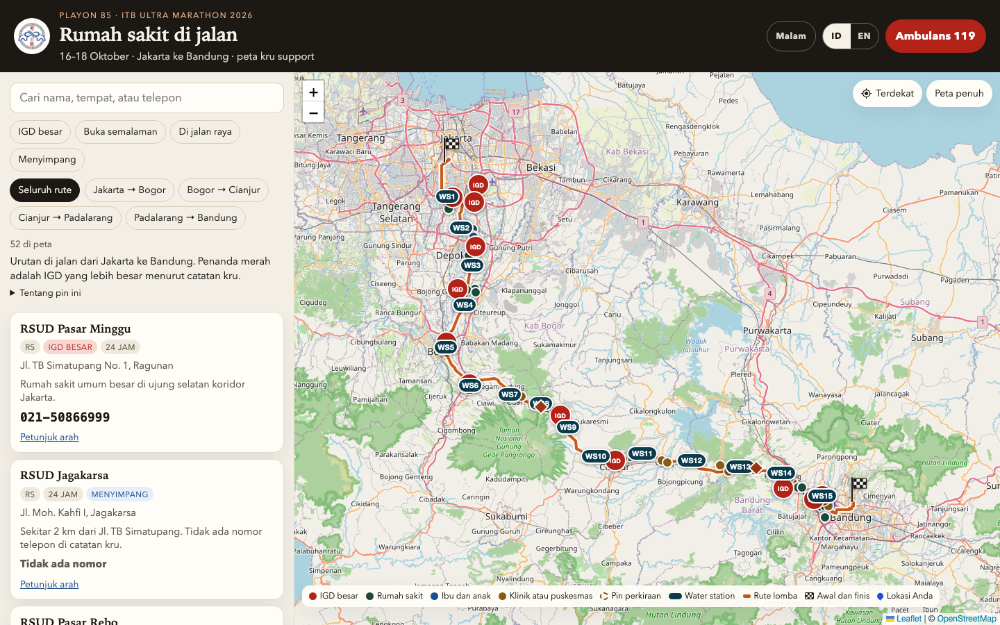
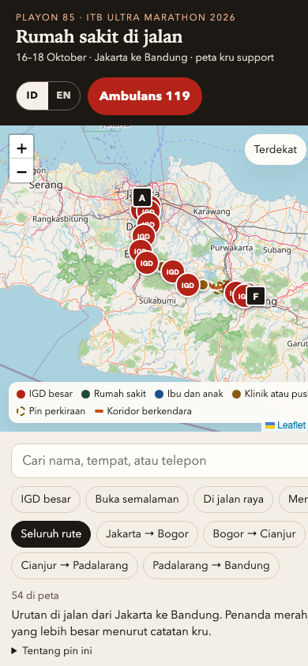

# Playon Guidance

Live site: https://primayuda.github.io/PlayonGuidance/

A support-crew map of hospitals, clinics, and emergency rooms along the ITB Ultra Marathon 2026 route, from Jakarta to Bandung, for Playon 85.

The race is 16–18 October 2026. The site opens in Indonesian. Switch to English with **EN** in the header. **Malam** switches to a dark map for the night.

## Full screen



## Mobile



## Open it

There is no build step. To preview it on this computer, run this in the folder and open http://localhost:8000:

```sh
python3 -m http.server 8000
```

Opening `index.html` straight from the file leaves the base map blank, because OpenStreetMap refuses tiles to a page with no web address. The map tiles also need a network connection the first time they are viewed.

On a phone, add the page to the home screen. After one visit online, a reload with no signal still shows the list, the phone numbers, and the map tiles already seen along the route.

- Search by name, place, or phone.
- On a phone, the route sections stay in one row: Jakarta–Bogor, Bogor–Cianjur, Cianjur–Padalarang, and Padalarang–Bandung. **Saring** opens the other filters: a major emergency room, places open overnight, places on the road, or detours.
- Call a listed number, or open turn-by-turn directions.
- A place with no number in the crew notes shows **Tidak ada nomor**.
- **Terdekat** finds the nearest place from your location.
- On a phone, **Ambulans 119** is the red button at the bottom of the map. On a larger screen it stays in the header.
- Water stations are on the desktop map. On a phone they stay hidden until **WS** is tapped.
- Two diamonds mark stretches with no general hospital, at Puncak Pass and the Cipatat cliffs. They stay on the map and are not rows in the list.

The orange line is the ITB Ultra Marathon 2026 route from the [race map](https://www.google.com/maps/d/viewer?mid=18xsq7cKCM6lcQOvMwXg0qjceXzdH4_o), about 178 km. Phones and hours come from the Playon crew notes.

Created by [Prima](https://primayuda.dev/).
